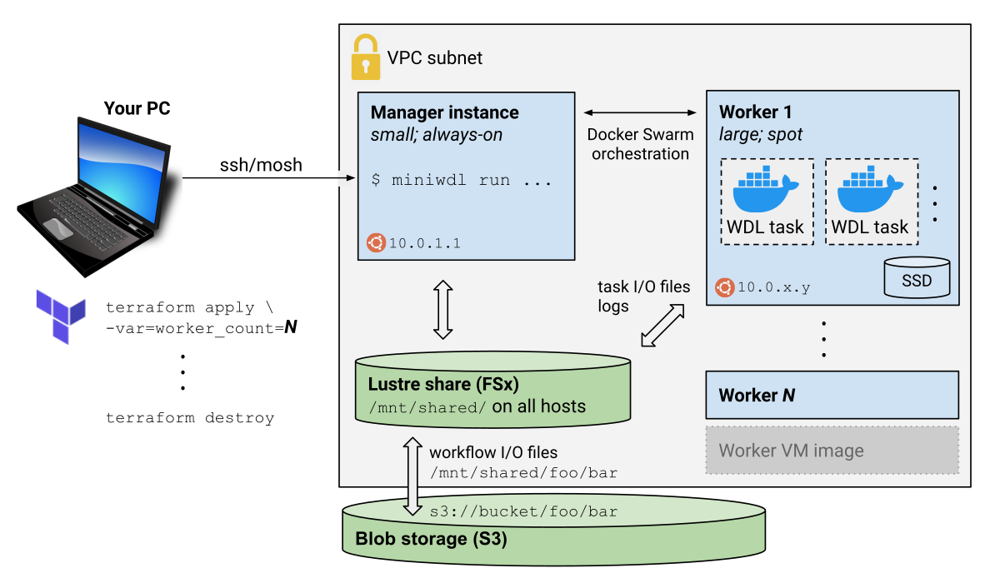

# miniwdl-cloud

Orchestrate a cloud fleet to run [WDL](https://openwdl.org/) workflows using [miniwdl](https://github.com/chanzuckerberg/miniwdl) and [Docker Swarm mode](https://docs.docker.com/engine/swarm/).

**Audience:** this framework is for advanced operators at ease with using [Terraform](https://www.terraform.io/) to provision infrastructure in their own cloud account, and then SSHing in to use `miniwdl run`. It's oriented to individual use in WDL data processing projects needing up to ~100 compute nodes (⇒ a few thousand processors), deployed as-needed and torn down when done. It can be used for automated, large-scale "production" operations too, but other solutions like [Cromwell](https://cromwell.readthedocs.io/en/stable/) or [dxWDL](https://github.com/dnanexus/dxWDL) may be better suited. And running miniwdl locally on a single, very large compute node is *much* simpler if it suffices!

AWS is targeted initially, but we've relied on basic infrastructure services to preserve portability to other clouds. Hacking on the included Terraform configurations (+ [Ansible](https://www.ansible.com/overview/how-ansible-works) playbooks for host setup) is encouraged.

  * [Overview of moving parts (AWS)](#overview-of-moving-parts--aws-)
  * [Getting Started](#getting-started)
    + [Prepare terminal session](#prepare-terminal-session)
    + [Deploy infrastructure](#deploy-infrastructure)
    + [Connect to manager and run workflows](#connect-to-manager-and-run-workflows)
  * [S3 I/O](#s3-i-o)
    + [S3 input](#s3-input)
    + [Automatic writeback of workflow outputs](#automatic-writeback-of-workflow-outputs)
    + [Custom S3 output](#custom-s3-output)
  * [Scaling up & down](#scaling-up---down)
    + [Worker instance type](#worker-instance-type)
    + [Worker fleet scaling](#worker-fleet-scaling)
    + [Scaling guidelines](#scaling-guidelines)
  * [Monitoring](#monitoring)
  * [Security](#security)

## Overview of moving parts (AWS)



**Compute:**
* Manager instance (small, on-demand) hosts user SSH session, miniwdl, and Docker Swarm manager
* Worker instances (large, spot) host WDL task containers, scheduled by miniwdl via Docker Swarm
* Docker Swarm multiplexes WDL tasks onto workers based on their CPU/memory requirements
* Scale worker fleet as needed with `terraform apply ... -var=worker_count=N`
* VPC exposes only the the manager's SSH (and [mosh](https://mosh.org/)) to remote access

**Storage:**
* All instances mount a [FSx for Lustre](https://aws.amazon.com/fsx/lustre/) shared file system
* WDL tasks read inputs from, and write outputs to, this shared file system
* The shared file system is [linked to an S3 bucket](https://docs.aws.amazon.com/fsx/latest/LustreGuide/fsx-data-repositories.html) where input files can be read & output files written back
* Workers use [instance store](https://docs.aws.amazon.com/AWSEC2/latest/UserGuide/InstanceStorage.html) for Docker images & container scratch space

## Getting Started

Prerequisites:

* S3 bucket for input & output files, in your preferred AWS region.
  * Suggestion: create a new bucket with test inputs & use it to try out the S3 I/O functionality here, before using any important bucket.
* [AWS CLI](https://docs.aws.amazon.com/cli/latest/userguide/install-cliv2.html), configured with [credentials](https://docs.aws.amazon.com/cli/latest/userguide/cli-configure-files.html) and ([role](https://docs.aws.amazon.com/cli/latest/userguide/cli-configure-role.html) if applicable) so that commands work on the desired account without any explicit auth arguments.
* [terraform](https://www.terraform.io/downloads.html)
* SSH key pair (a default one in `~/.ssh/id_rsa[.pub]` is fine)
* [mosh](https://mosh.org/#getting) (recommended to improve SSH experience)

### Prepare terminal session

Clone this repo or your preferred version/fork thereof:

```
git clone https://github.com/mlin/miniwdl-cloud.git
cd miniwdl-cloud
```

Open the [`environment`](https://github.com/mlin/miniwdl-cloud/blob/master/environment) file in your editor and customize it as needed, in particular setting the AWS region/AZ and S3 bucket name. Then,

```
source environment
```

and verify the displayed information.

### Deploy infrastructure

Initialize Terraform and deploy the stack:

```
terraform init terraform/aws/swarm
terraform apply terraform/aws/swarm
```

This takes about 20 minutes to:

1. Create VPC & firewall rules
2. Provision shared file system
3. Launch manager instance & install miniwdl and Docker Swarm
4. Launch worker template instance and configure it to join the swarm on boot
5. Snapshot VM image from worker template instance
6. Issue spot instance requests using worker VM image

### Connect to manager and run workflows

Once the deployment is complete, start a [mosh](https://mosh.org/) SSH session with the new manager instance. 

```
mosh wdler@$(terraform output manager_ip)
```

(You might use a separate terminal window/tab for this, to continue working with Terraform alongside.) This brings you into a [Byobu](https://www.byobu.org/) window for the **wdler** user, who has sudo and Docker permissions.

Try a test workflow:
```
miniwdl run_self_test --dir /mnt/shared/runs
```

The task containers run on the worker spot instances, orchestrated by miniwdl & Docker Swarm from the small manager node you're logged into, all mounting `/mnt/shared` through which input/output files and logs are exchanged.

Following the self-test, you can browse the run directory under `/mnt/shared/runs` and also find a copy of its log and output JSON in a corresponding location in your S3 bucket. (The self-test workflow doesn't output any files.)

From here, you can `miniwdl run ... --dir /mnt/shared/runs` your own WDL workflows, perhaps supplied from your PC using `scp`  or an [editor plugin](https://code.visualstudio.com/docs/remote/ssh), or downloaded using `wget` or `git` on the manager. Input files can be sourced from the linked S3 bucket (discussed next) or public URIs.

## S3 I/O

On AWS, miniwdl-cloud relies on [FSx for Lustre features](https://aws.amazon.com/fsx/lustre/features/?nc=sn&loc=2#Seamless_integration_with_your_Amazon_S3_data) handling transfers to and from the linked S3 bucket, simplifying file localization for WDL workflows.

### S3 input

During creation of the FSx for Lustre share, it's populated with file & directory entries mirroring your S3 bucket. For example, the object `s3://your-bucket/foo/bar.txt` surfaces as `/mnt/shared/foo/bar.txt`, which `miniwdl run` can use as an input like any local file. (FSx automatically transfers the S3 data when needed; [see its docs](https://docs.aws.amazon.com/fsx/latest/LustreGuide/fsx-data-repositories.html))

### Automatic writeback of workflow outputs

The manager configures miniwdl to write workflow outputs back to S3 via FSx. For example, if the workflow generates an output file `/mnt/shared/runs/12345_hello/output_links/result/data.txt`, it's written back to `s3://your-bucket/runs/12345_hello/output_links/result/data.txt`. It also writes the workflow log file and `outputs.s3.json`, a version of the outputs JSON with `s3://` URIs instead of local File paths.
* Only top-level run outputs are written to S3 (excluding nested call outputs that aren't output from the top-level run), while everything remains on `/mnt/shared`.
* Auto-writeback can be disabled for a run by setting `MINIWDL__FSX_TO_S3__AUTO=false` in the environment, which can be useful for dev/test without cluttering your S3 bucket.

### Custom S3 output

Alternatively, you can instruct FSx to write arbitrary files under `/mnt/shared` to S3 by running `fsx_to_s3 {file_or_directory}`. If the default run folder organization doesn't suit you, then disable auto-writeback, populate a subdirectory tree corresponding to the desired S3 key layout, and then `fsx_to_s3` the subdirectory (e.g. `/mnt/shared/results/data.txt` to `s3://your-bucket/results/data.txt`).
* To avoid copying large files on Lustre, you can `mv` them in or create additional [hard links](https://en.wikipedia.org/wiki/Hard_link) to their existing inodes (`fsx_to_s3` won't work on symbolic links).
* Take care that it's possible to overwrite existing S3 objects when `fsx_to_s3` writes to keys derived from the Lustre file paths.
* The [`fsx_to_s3` script](https://github.com/mlin/miniwdl-cloud/blob/master/ansible/roles/aws_fsx_lustre_client/files/fsx_to_s3) awaits completion of the S3 transfers. [FSx docs](https://docs.aws.amazon.com/fsx/latest/LustreGuide/exporting-files-hsm.html) describe low-level commands available to initiate them asynchronously.

## Scaling up & down

### Worker instance type

The default worker instance type `m5d.4xlarge` can be changed by setting the `worker_instance_type` Terraform variable (environment `TF_var_worker_instance_type` or `terraform apply -var=worker_instance_type=....`). You can change the worker type of an existing cluster by re-running `terraform apply terraform/aws/swarm` with the new variable setting; this will terminate existing workers and launch the new using the existing VM image.

Considerations:

* The worker instance type should meet or exceed the highest individual `runtime.cpu` and `runtime.memory` reservations expected across the tasks, to ensure every task can get an appropriate worker.
  * If a task's resource reservations exceed the worker type, miniwdl will log a warning and "round down" to match. This prevents deadlock, but the task may run suboptimally or crash.
  * Workers can run multiple smaller tasks concurrently to the extent they fit based on the reservations.
* Instance families with [NVMe instance store volumes](https://docs.aws.amazon.com/AWSEC2/latest/UserGuide/ssd-instance-store.html) are recommended for optimal Docker performance: such as M5d (general-purpose), C5d (compute-optimized), R5d (high mem), and I3 (high mem & scratch).
* Cost and spot price volatility

### Worker fleet scaling

There's a simplistic scale-out mechanism involving a main fleet of workers that stay up always (subject to spot pricing), and a second fleet of "burst" workers that expands on your command and contracts with inactivity. The size of these pools is controlled by the `worker_count` and `burst_worker_count` Terraform variables, respectively, e.g.

```terraform apply -var=worker_count=2 -var=burst_worker_count=6 terraform/aws/swarm```

This can be used at the launch of a new cluster, or reapplied to an existing cluster as needed. New workers will join the swarm automatically.

* `worker_count` workers launch under persistent spot instance requests; they shut down when the spot price spikes above the on-demand price, but later recover automatically.
* `burst_worker_count` workers launch under one-time requests, so they don't recover themselves until you run `terraform apply` again. Additionally, burst workers self-terminate after 30 minutes of inactivity (no task containers).

A [pre-configured default policy](https://github.com/mlin/miniwdl-cloud/blob/037d49b7fafc05d465b80a31d48e8c77a02fc496/ansible/files/aws_manager/miniwdl.cfg#L23) will retry tasks interrupted by a worker shutting down, up to three attempts total.

Many workflows involve a processing-intensive scatter, followed by smaller downstream tasks. The typical usage of this scheme is to expand the burst fleet once the scatter is underway, then let it contract while a smaller persistent fleet remains to handle post-processing.

### Scaling guidelines

The framework is tested to handle around 100 concurrent tasks comfortably (each potentially using many CPUs).
* The manager instance type may need an upgrade if the tasks turn over very rapidly and/or output many thousands of files. (Terraform variable `manager_instance_type` defaults to `t3a.medium` and should be set during initial launch)
* The [Lustre share's performance](https://docs.aws.amazon.com/fsx/latest/LustreGuide/performance.html) is proportional to its provisioned size. (Terraform variable `lustre_GiB` defaults to the minimum of 1200 and can be set an increments of 1200 at initial launch)
* If miniwdl ([Python GIL](https://wiki.python.org/moin/GlobalInterpreterLock) constrained) seems to be the bottleneck, you can `miniwdl run` separate workflows concurrently from the manager.

If you don't need to run anything for a period of time, then you can zero out the worker fleets, and even stop the manager instance (but its IP may change on relaunch). Or you can `terraform destroy terraform/aws/swarm` to tear down everything and start afresh next time.

Also see the [miniwdl documentation's guidelines](https://miniwdl.readthedocs.io/en/latest/runner_advanced.html#wdl-guidelines) for scalable WDL patterns. Here, it's especially helpful if [tasks write scratch files under `$TMPDIR`](https://miniwdl.readthedocs.io/en/latest/runner_advanced.html#write-scratch-files-under-tmpdir) instead of their working directory. That's because `$TMPDIR` is on the workers' local scratch volumes, while the working directory is on the Lustre share.

## Monitoring

From the manager, you might start a workflow running and then [open more byobu windows](https://simonfredsted.com/1588) to monitor:

* `docker node ls` shows the swarm
* `docker service ls` shows the running and queued tasks
* You can "tail" tasks' standard error streams from `stderr.txt` in the run directory under `/mnt/shared` (even if miniwdl isn't running with verbose logging)
* `htop` to monitor stress on the manager instance itself
* `tree -tD /mnt/shared/.swarm/workers` shows a custom directory tree whose contents and modification times reflect worker status; see [swarm_worker_heartbeat.sh](https://github.com/mlin/miniwdl-cloud/blob/master/ansible/roles/worker_template/files/swarm_worker_heartbeat.sh) for details.
* As `wdler` you can ssh to any worker (+sudo)

Separately,

* [FSx CloudWatch metrics](https://docs.aws.amazon.com/fsx/latest/LustreGuide/monitoring_overview.html) indicate the Lustre share's stress level

## Security

Everything runs within a VPC subnet in the designated availability zone, with only the manager's ssh and mosh ports open to Internet ingress. The SSH key you specify in `environment` is the only one permitting login to the manager, as `wdler` or the default `ubuntu` user. Software updates are only installed during initial deployment, since the infrastructure isn't meant to be long-lived.

Within the VPC, instances can communicate for Swarm coordination, Lustre transfers, and manager>worker SSH (using a "jump" key created & stored on the manager). However, they all load [iptables rules](https://github.com/mlin/miniwdl-cloud/tree/master/ansible/roles/aws_docker_config/tasks) to block WDL tasks (running in Docker) from directly contacting Swarm, Lustre, and the [EC2 instance metadata service](https://docs.aws.amazon.com/AWSEC2/latest/UserGuide/instancedata-data-retrieval.html). Internet egress is otherwise unrestricted.

Through FSx, you & miniwdl (but not WDL tasks) can read or write anything in the linked S3 bucket. There are otherwise *no* [IAM roles/profiles](https://www.terraform.io/docs/providers/aws/r/iam_instance_profile.html) to access AWS resources.

Advanced customizations of these defaults could include:
* Restrict manager ingress to your source IP only
* [TOTP factor](https://aws.amazon.com/blogs/startups/securing-ssh-to-amazon-ec2-linux-hosts/) for SSH
* IAM role for manager and/or workers
* Unblock instance metadata so that WDL tasks can assume IAM role
